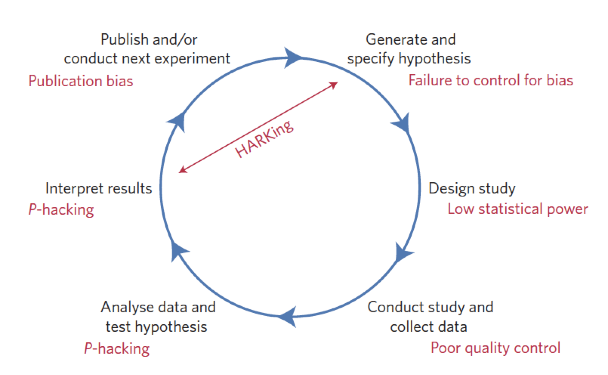
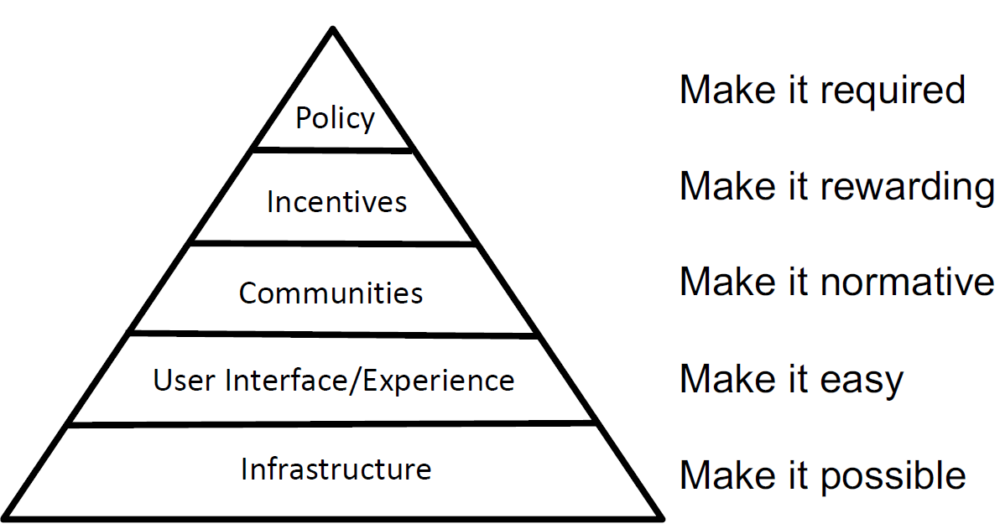
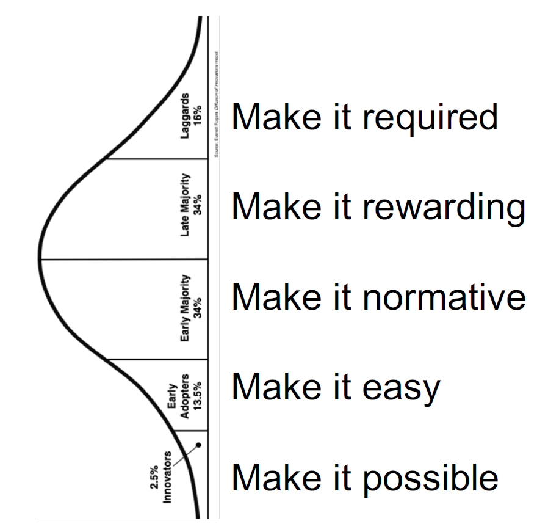

class: inverse, middle, title-slide

```{r setup, include=FALSE}
library(fontawesome)
library(tidyverse)
options(htmltools.dir.version = FALSE, width=120)
```

class: title-slide, spaced


# Encouraging Academics to Embrace #OpenScience
## The 5th UGM Public Health Symposium `r fa("universal-access")`
<br>
### <b>Rizqy Amelia Zein</b>
### Lecturer, [Faculty of Psychology, Universitas Airlangga](https://psikologi.unair.ac.id)
### Researcher-in-training, [Institute for Globally Distributed Open Research and Education (IGDORE)](https://igdore.org/)

---

class: center, middle

# Keeping in touch  

`r fa("paper-plane")` <a href="mailto:amelia.zein@psikologi.unair.ac.id"></i>&nbsp; amelia.zein@psikologi.unair.ac.id</a>
`r fa("twitter")` [@ameliazein](https://twitter.com/ameliazein)
`r fa("github")` [@rameliaz](https://github.com/rameliaz)
`r fa("desktop")` https://rameliaz.github.io


The slides are licensed as `r fa("creative-commons")` BY-NC 4.0 and available in my `r fa("github")` [repository](https://github.com/rameliaz/5th-UGM-Public-Health-Symposium).

---
class: inverse, center, middle

# Getting it right, not just getting it published<sup>*</sup>

### Is "publish or perish" culture still relevant?
### How can we change the norms?
### Why is science too polluted by noises?
### What should we do to improve this situation?
### How is the best strategy to promote #OpenScience to academics?

.footnote[
[*] [Brian Nosek](https://doi.org/10.1177/1745691612459058)(2019) as presented in [Open Science Symposium](https://www.ugent.be/en/agenda/1552411542557) in Ghent University
]

---

# Changing the norms

--

- From `secrecy` to `communality`

--

  + We need to make our works **openly accessible** to everyone instead of **locking those up** in paywalled outlets
  
--

- From `particularism` to `universalism`

--

  + Despite **the reputation** (metrics, citation count), we should solely assess research impacts by **its own merit**
  
--

- From `self-interestedness` to `disinterestedness`

--

  + Treating science as **a competition**? Bad idea! It definitely [**hinders innovations**](https://www.theguardian.com/higher-education-network/2018/jun/15/is-competition-driving-innovation-or-damaging-scientific-research). 
  + Can we put our **love of knowledge** and our **desire to discover** something (useful) as our motivations instead?

--

- From `dogmatism` to `skepticism`

--

  + Stop putting too much time **to defend certain theories** or findings, start to consider **all new evidence**
  
--

- From `quantity` to `quality`

--

  + **Stop relying on crude metrics**. The real question that should be answered: have our research been done with **sound methodology**? **Are the findings credible?**
  
---

class: middle, inverse, center

# The trouble with our current way of doing science...


---

class: middle, center

# Threats to Reproducible Science



.footnote[
[Munafo et al. (2017)](https://www.nature.com/articles/s41562-016-0021)
]

---

# Replication crisis is real...

--

1. Plaguing almost every disciplines

--
  + Including [medicine](https://doi.org/10.1126/scitranslmed.aaf5027), [biology](https://link.springer.com/article/10.1007/s11538-018-0497-0), [chemistry](https://pubs.acs.org/doi/abs/10.1021/acs.jchemed.7b00907), [hydrology](https://www.nature.com/articles/sdata201930?fbclid=IwAR3nMcbsjpDOQxj9jxLBxYsrdTmcjBTUq3CsWydyW0pl-PPmwKe8hiZsOQg#f2), [psychology](https://www.pnas.org/content/115/11/2628), and many more! (it's a long list, tbh)

--

1. The danger: Undermining **the credibility of science** (and scientists, too)

--

1. Integrity is **preceeded by** openness, transparency and sharing

--

1. Science and pseudoscience are no longer distinguishable

--

1. Cumulative science is not so useful anymore, because it is based on highly-biased estimation (due to publication bias)<sup>1</sup>

--

1. John Ioannidis<sup>2</sup> argues that "...there is massive production of **unnecessary**, **misleading**, and **conflicted systematic reviews** and **meta-analyses**. Instead of promoting evidence-based medicine and health care, these instruments often serve mostly as **easily produced publishable units or marketing tools**..."


.footnote[
[1] See [Lin (2018)](https://journals.plos.org/plosone/article?id=10.1371/journal.pone.0204056)<br>
[2] The context of this criticism is a massive increase of the number of meta-analytic study from 1986 to 2015, yet the studies were mostly sponsored by large industries with high potential of conflict of interest. See [Ioannidis (2016)](https://onlinelibrary.wiley.com/doi/abs/10.1111/1468-0009.12210)
]

---

class: middle, center, inverse

# How can we improve it?


---

# A Manifesto for Reproducible Science<sup>*</sup>

- Protecting against (our) cognitive biases (because even scientists *are not free* from biases)

- Improving methodological training (this is what we *truly* need)

- Independent methodological support (do we need independent science critics?)

- Collaboration and team science (definitely, no more competition! we are *bad* at it)

- Promoting study [pre-registration](https://wwww.pnas.org/cgi/doi/10.1073/pnas.1708274114)

.footnote[[*] [Munafo et al. (2017)](https://www.nature.com/articles/s41562-016-0021)]

---

# A Manifesto for Reproducible Science<sup>*</sup>

.pull-left[
- Improving the quality of reporting (complete & reproducible)

- Protecting against conflicts of interest

- Encouraging transparency and open science
  + Share materials and data, use open-source, reproducible software (`r fa("r-project")`, `r fa("python")` and many more)
  
- Diversifying peer review (why not make it open?)

- Rewarding open and reproducible practices (not relying on crude metrics)
]

.pull-right[


]

.footnote[[*] [Munafo et al. (2017)](https://www.nature.com/articles/s41562-016-0021)]

---

# Changing research culture<sup>*</sup>




.footnote[
[*] As presented by [Brian Nosek (2019)](https://t.co/MYayc2QUNZ)
]

---

# Promoting #OpenScience to Academia<sup>*</sup>



.footnote[
As presented by [Brian Nosek (2019)](https://t.co/MYayc2QUNZ); Diffusion of Innovations, [Rogers (1963)](https://encrypted-tbn0.gstatic.com/images?q=tbn:ANd9GcQPPuJwBUEjvMiuBLWy5YEgiteCa0Z9DZ92IMnFWFGzTGlIkLPQiw)
]


---

class: center, middle, inverse

# Many thanks!

Slides created via the R package [**xaringan**](https://github.com/yihui/xaringan) using `R-Ladies` template and fonts.

The chakra comes from [remark.js](https://remarkjs.com), [**knitr**](http://yihui.name/knitr), and [R Markdown](https://rmarkdown.rstudio.com).
